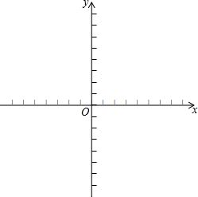

## Task面向对象编程

#### 1.完成廖雪峰 **类的实例** 和 **访问限制** 部分
#### 2.完成下面一道编程题

### Programming Assignment 2 : 移动机器人(一)
  

* 创建一个机器人类
* 有**姓名**，**坐标**（x坐标和y坐标），**朝向**(上下左右) 等私有属性
* 初始化时接受一个字符串作为姓名，将坐标初始化在原点（0，0），朝向初始化为 **上**（y轴正方向）
* 提供 **向左转** **向右转** 方法，每次调用改变机器人朝向
* 提供 **向上移动一步**、**向下移动一步**、**向左移动一步**、**向右移动一步**的方法，只有机器人朝向某个方向时才能往该方向移动（如：面朝左边时，只能向左移动，此时如果想向上移动，需要先向右转）
* 提供 **打印当前坐标** 的方法

程序要求：创建一个机器人，移动到（4，2）的位置，途径（2，6）
