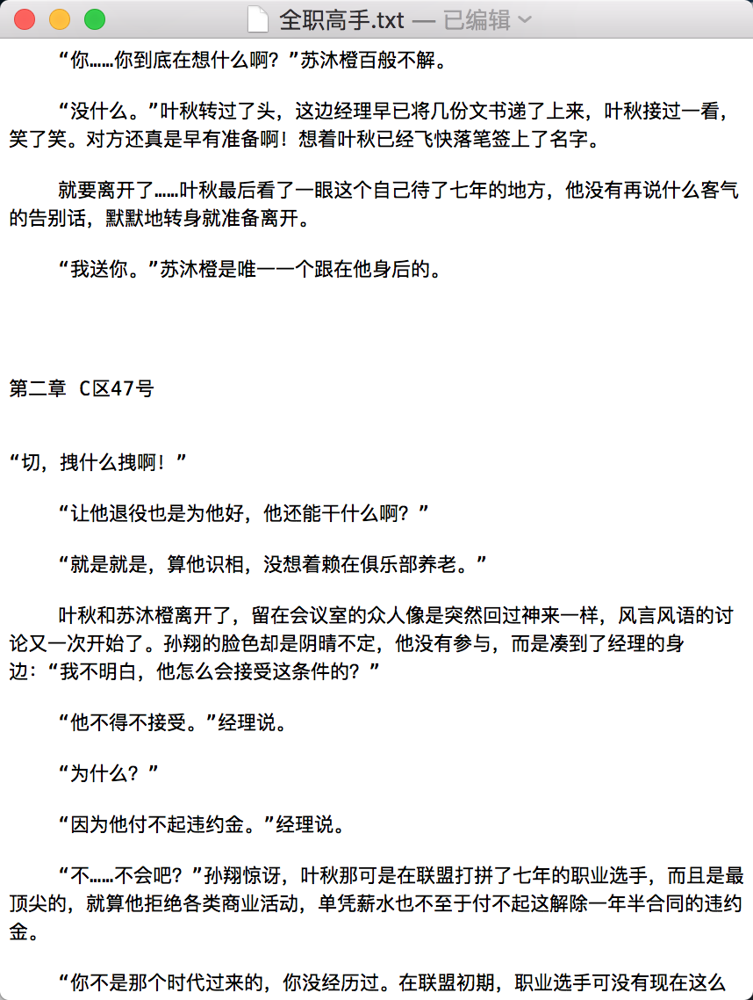

## Task

### Programming Assignment 3 : 爬虫实战（一）爬取《全职高手》

[请戳这里](http://www.biqudu.com/0_32/)

《全职高手》是蝴蝶蓝连载于起点中文网的电竞小说。
该小说讲述了网游顶尖高手叶修，遭到俱乐部的驱逐，而后在荣耀新开的第十区重新投入了游戏，召集一群志同道合的伙伴，重返巅峰之路的故事。
   
  
### 程序要求:  

1. 将整本小说从 **“第一章 被驱逐的高手”** 到 **最后一次上传,完本感言** 里面的内容保存到 **“全职高手.txt”** 文件中
2. txt文件的内容格式如下图， "第一章章节名 第一章内容 第二章章节名 第二章内容 ......"  

